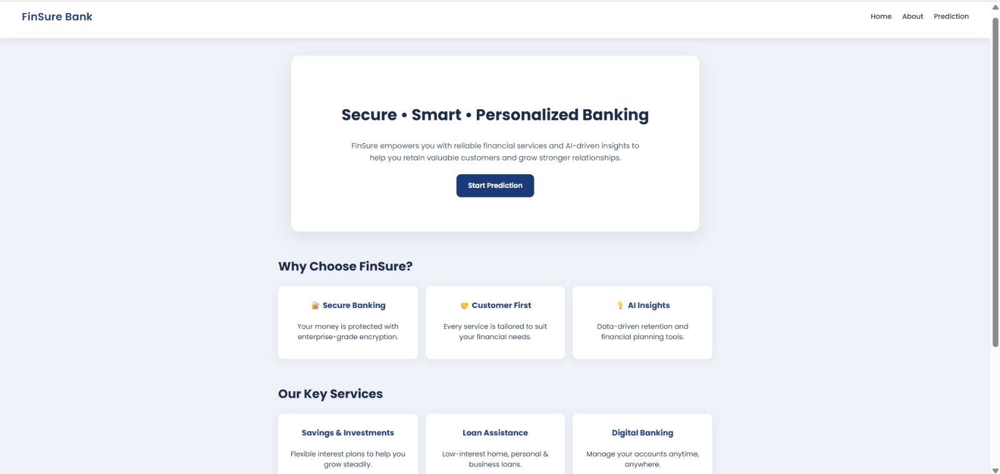
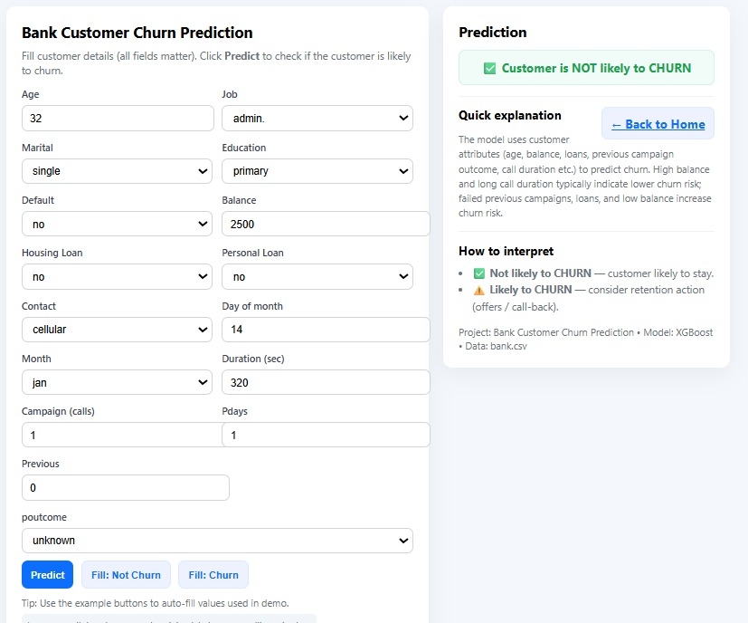
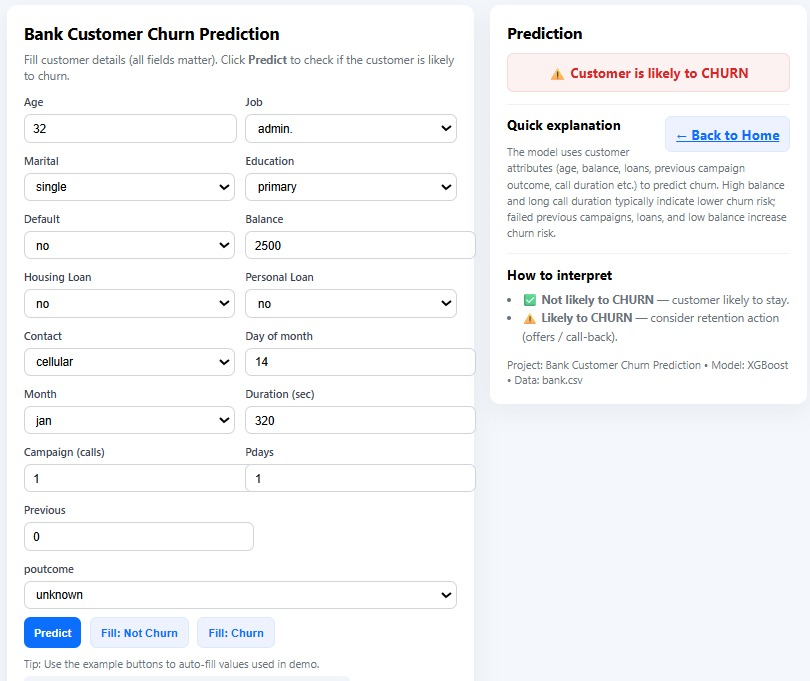

# BankIntelli-Churn-Prediction-using XGBoost and Flask.

Abstract 
Customer churn is a major challenge for financial institutions, as retaining existing clients is more cost-effective than acquiring new ones. This project focuses on predicting customer churn in the banking sector using machine learning techniques. The primary objective is to analyze customer demographic and transactional data to identify factors influencing churn, enabling banks to take proactive retention measures.
A publicly available dataset containing customer information such as age, balance, credit score, geography, gender, tenure, number of products, and estimated salary is used for analysis. Data preprocessing and exploratory data analysis (EDA) are performed to uncover behavioral patterns and trends. Various supervised learning algorithms, including Logistic Regression, Random Forest, and XGBoost, are implemented and compared based on evaluation metrics such as accuracy, precision, recall, and F1-score.
The resulting predictive model effectively classifies customers as likely to churn or remain loyal. This model enables banks to improve customer retention strategies, enhance satisfaction, and increase profitability through data-driven decision-making.

### 📂 Directory Structure
Bank-Customer-Churn-Prediction/
```
│
├── app.py                     # Flask application for deployment
├── bank.csv                   # Dataset (Bank Marketing data)
├── step1_load_data.py          # Script for loading and inspecting data
├── step2_train_model.py        # Script for data preparation and model training
│
├── model/
│   ├── xgb_model.pkl           # Trained XGBoost model
│   ├── label_encoders.pkl      # Encoders for categorical variables
│   └── columns.pkl             # List of model input columns
│
├── templates/
│   ├── index.html              # Main prediction form (user input + results)
│   ├── home.html               # Homepage describing the project
│   └── about.html              
```

### 📊 Exploratory Data Analysis (EDA)

Exploratory Data Analysis was performed to understand the structure, quality, and relationships within the data before training the model.
step 1 :
       This includes cleaning data, by checking for:
       1. Data Overview
       2. Unique Value Counts (Categorical Columns)
       3. Statistical Summary
       4. Outlier Detection & Handling
       5. Univariate Analysis
           (a) Distribution of Target Variable — deposit
               A bar chart of deposit decisions showed:
               Slightly more customers said “no” than “yes.”

           (b) Age Distribution by Deposit Status
               Customers aged 30–45 years were more likely to subscribe to a term deposit.
               Younger (<30) and older (>60) groups showed lower interest.
       6. Bivariate Analysis
            (a) Deposit Rate by Job Type
                Bar plot comparing job categories:
                Admin, management, technician roles had higher subscription rates.
                Blue-collar, unemployed, and student groups were less likely to subscribe.
            (b) Deposit Rate by Education Level
                Customers with tertiary (higher) education showed more interest in deposits.
                Lower education levels correlated with fewer positive responses.

       7. Multivariate Analysis
          (a) Duration vs Balance by Deposit
              A scatter plot of call duration vs account balance colored by deposit decision showed:
              Longer calls and higher balances → more “yes” responses.
              Shorter calls and lower balances → more “no” responses.

                INTERPRETATION :
                Call duration reflects engagement — more time spent often means higher customer interest.

          (b) Correlation Heatmap (Numeric Features)
              Heatmap was used to examine relationships among numerical variables.

          Correlation Value	Meaning
             +1	Strong positive relationship
             -1	Strong negative relationship
              0	No relationship

          Key Observations:
             duration correlated positively with deposit. 


### 🤖 Model Training and Evaluation

Model Used:
XGBClassifier (Extreme Gradient Boosting)

Training Workflow:
1. Label-encoded all categorical variables.
2. Defined target as deposit (1 = subscribed, 0 = not subscribed).
3. Split dataset into train and test sets.
4. Trained the model and evaluated accuracy.
5. Saved artifacts for Flask inference (.pkl files).

Performance Summary:
Metric	Value (approx.):
- Training Accuracy	0.90
- Testing Accuracy	0.88

Top 5 Features Influencing Predictions:
1. duration – Call length with the customer
2. poutcome – Outcome of the previous campaign
3. balance – Account balance
4. housing – Existence of a housing loan
5. education – Education level of the client


### 🌐 Web Application (Flask)

The model is integrated into a Flask web app that allows users to make real-time predictions.

Pages:

- Home (home.html) → Overview of the project and navigation to prediction page
- About (about.html) → Brief about the model and author
- Predict (index.html) → Main form to input customer details and display prediction

Workflow:

- User enters data (age, job, balance, etc.) on the form.
- Flask backend loads the saved model and encoders.
- Input data is reindexed and encoded to match training columns.
- Model predicts whether the customer will subscribe or not.

Result is displayed on the same page:

- ✅ Customer is NOT likely to CHURN → will subscribe

- ⚠️ Customer is likely to CHURN → may not subscribe

  ### 📊 Visual Outputs





### Future Enhancements

- Add SHAP explainability to show feature impact per prediction.

- Handle unseen categories more gracefully in Flask app.

- Display model confidence/probability with each result.


### 👩‍💻 Contact:

Keerthanaa S - skeerthanaa2004@gmail.com
🔗 LinkedIn(www.linkedin.com/in/keerthanaa-s-a3a99328b)


                
